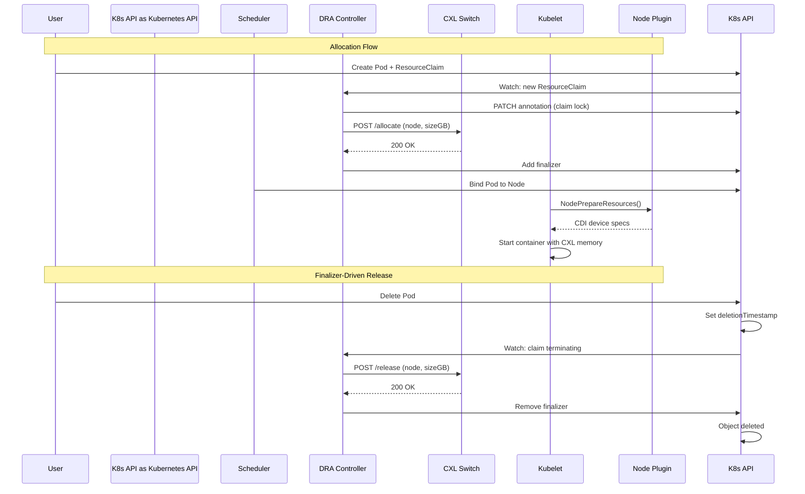

# CXL DRA Driver

[](https://github.com/justin-oleary/cxl-dra-driver/actions/workflows/ci.yaml)
[](https://github.com/justin-oleary/cxl-dra-driver/releases)
[](https://goreportcard.com/report/github.com/justin-oleary/cxl-dra-driver)
[](https://go.dev/)
[](LICENSE)

Kubernetes Dynamic Resource Allocation (DRA) driver for CXL pooled memory orchestration.

## Contents

- [Overview](#overview)
- [Architecture](#architecture)
- [Requirements](#requirements)
- [Quick Start](#quick-start)
- [Usage](#usage)
- [Configuration](#configuration)
- [Development](#development)
- [Contributing](#contributing)

## Overview

This driver enables Kubernetes workloads to request CXL (Compute Express Link) pooled memory through the DRA framework. When a pod requests CXL memory via a ResourceClaim, the driver:

1. Allocates memory from the CXL switch pool
2. Prepares the memory for container use via the kubelet plugin interface
3. Releases memory back to the pool when the pod terminates

### Allocation and Release Flow



The controller uses an **annotation-based distributed lock** to prevent double allocation across replicas, and a **finalizer** to guarantee hardware release before API object deletion. See [docs/architecture.md](docs/architecture.md) for the full systems engineering analysis.

## Architecture

```
┌─────────────────────────────────────────────────────────────────┐
│                     Kubernetes Cluster                          │
│  ┌──────────────────┐           ┌───────────────────────────┐  │
│  │  DRA Controller  │           │  Node Plugin (DaemonSet)  │  │
│  │   (Deployment)   │           │                           │  │
│  ├──────────────────┤           ├───────────────────────────┤  │
│  │ • Watch claims   │           │ • kubelet gRPC interface  │  │
│  │ • Annotation lock│           │ • NodePrepareResources    │  │
│  │ • Finalizer mgmt │           │ • NodeUnprepareResources  │  │
│  └────────┬─────────┘           └───────────────────────────┘  │
│           │                                                     │
└───────────┼─────────────────────────────────────────────────────┘
            │ HTTP
            ▼
┌─────────────────────┐
│  CXL Memory Switch  │
│     (External)      │
├─────────────────────┤
│ • /allocate         │
│ • /release          │
│ • Pool management   │
└─────────────────────┘
```

| Component | Description |
|-----------|-------------|
| Controller | Watches ResourceClaims, coordinates with CXL switch via annotation-based locking |
| Node Plugin | gRPC server implementing kubelet DRA plugin interface |
| Mock Switch | Development/testing CXL hardware simulator |

## Requirements

- Kubernetes v1.35+ with `DynamicResourceAllocation` feature gate enabled
- Go 1.25+ (for development)

## Quick Start

```bash
# deploy to cluster
make deploy

# verify pods are running
kubectl -n cxl-system get pods
```


## Development

```bash
# install dependencies
go mod download

# run tests with coverage
make test

# run linters
make lint

# run fuzz tests
make fuzz

# build binaries
make build

# build container images
make docker-build
```

See `make help` for all available targets.

## Usage

Request CXL memory in a pod:

```yaml
apiVersion: v1
kind: Pod
metadata:
  name: my-app
spec:
  containers:
    - name: app
      image: myapp:latest
      resources:
        claims:
          - name: cxl-memory
  resourceClaims:
    - name: cxl-memory
      resourceClaimTemplateName: cxl-memory-claim-template
```

See [deploy/examples/](deploy/examples/) for complete examples.

## Configuration

Controller flags:
- `--cxl-endpoint` - CXL switch API URL (default: `http://localhost:8080`)
- `--kubeconfig` - Path to kubeconfig (uses in-cluster config if empty)

Node plugin flags:
- `--node-name` - Kubernetes node name (required)

## Contributing

See [CONTRIBUTING.md](CONTRIBUTING.md) for development guidelines.

## License

MIT - see [LICENSE](LICENSE)
