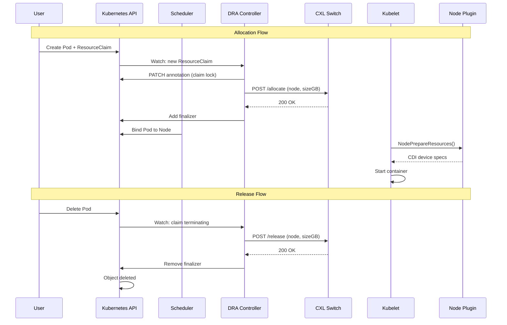

# CXL DRA Driver

[](https://github.com/justin-oleary/cxl-dra-driver/actions/workflows/ci.yaml)
[](https://go.dev/)
[](https://goreportcard.com/report/github.com/justin-oleary/cxl-dra-driver)
[](LICENSE)

> Kubernetes Dynamic Resource Allocation (DRA) driver for CXL pooled memory orchestration.

---

## Overview

This driver enables Kubernetes workloads to request CXL (Compute Express Link) pooled memory through the DRA framework. When a pod requests CXL memory via a ResourceClaim, the driver:

1. **Allocates** memory from the CXL switch pool
2. **Prepares** the memory for container use via the kubelet plugin interface
3. **Releases** memory back to the pool when the pod terminates

---

## Architecture



The controller uses an **annotation-based distributed lock** to prevent double allocation and a **finalizer** to guarantee hardware release. See [docs/architecture.md](docs/architecture.md) for the full design.

---

## Components

| Component | Description |
|-----------|-------------|
| **Controller** | Watches ResourceClaims, coordinates with CXL switch, manages finalizers |
| **Node Plugin** | gRPC server implementing kubelet DRA plugin interface |
| **Mock Switch** | Development/testing CXL hardware simulator |

---

## Requirements

- Kubernetes v1.35+ with `DynamicResourceAllocation` feature gate enabled
- Go 1.25+ (for development)
- CXL hardware switch with compatible API (or use mock-switch for testing)

---

## Quick Start

```bash
# Deploy to cluster (includes mock-switch for testing)
make deploy

# Verify pods are running
kubectl -n cxl-system get pods

# Create a test workload
kubectl apply -f deploy/examples/pod-with-claim.yaml
```

---

## Usage

Request CXL memory in a pod:

```yaml
apiVersion: v1
kind: Pod
metadata:
  name: my-workload
spec:
  containers:
    - name: app
      image: myapp:latest
      resources:
        claims:
          - name: cxl-memory
  resourceClaims:
    - name: cxl-memory
      resourceClaimTemplateName: cxl-memory-template
```

See [deploy/examples/](deploy/examples/) for complete examples.

---

## Configuration

### Controller Flags

| Flag | Description | Default |
|------|-------------|---------|
| `--cxl-endpoint` | CXL switch API URL | `http://localhost:8080` |
| `--kubeconfig` | Path to kubeconfig | in-cluster config |
| `--health-addr` | Health probe address | `:8081` |

### Node Plugin Flags

| Flag | Description | Default |
|------|-------------|---------|
| `--node-name` | Kubernetes node name | required |
| `--cdi-root` | CDI spec directory | `/etc/cdi` |

---

## Development

```bash
# Clone and setup
git clone https://github.com/justin-oleary/cxl-dra-driver.git
cd cxl-dra-driver

# Run tests with race detector
make test

# Run linters (golangci-lint, gosec)
make lint

# Run fuzz tests
make fuzz

# Build binaries
make build

# Build container images
make docker-build
```

Run `make help` for all available targets.

---

## Enterprise Edition

> **For AI research labs and GPU cloud providers**, we offer a commercial **Enterprise Edition** with advanced features for production GPU clusters.

### Premium Features

| Feature | Description |
|---------|-------------|
| **Predictive Pre-Warming** | Watches Deployments and HPAs to pre-allocate memory *before* pods schedule. Eliminates GPU idle time. |
| **Idle Memory Reclaim Sweeps** | 60-second reconciliation loop automatically reclaims orphaned allocations. Prevents hardware leaks. |
| **Offline Ed25519 License Verification** | Air-gapped cryptographic licensing with no network calls. FIPS 140-2 compliant. |
| **Prometheus Metrics** | Full observability with pre-built Grafana dashboards |
| **Enterprise Support** | SLA-backed support with priority response times |

### Learn More

- **Website:** [https://justin-oleary.github.io/cxl-dra-website](https://justin-oleary.github.io/cxl-dra-website)
- **Contact:** enterprise@justinoleary.com

---

## Contributing

We welcome contributions! See [CONTRIBUTING.md](CONTRIBUTING.md) for guidelines.

Please note that this project follows the [Contributor Covenant Code of Conduct](CODE_OF_CONDUCT.md).

---

## License

MIT License - see [LICENSE](LICENSE) for details.
